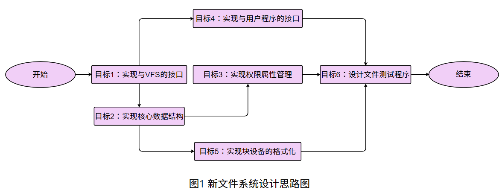
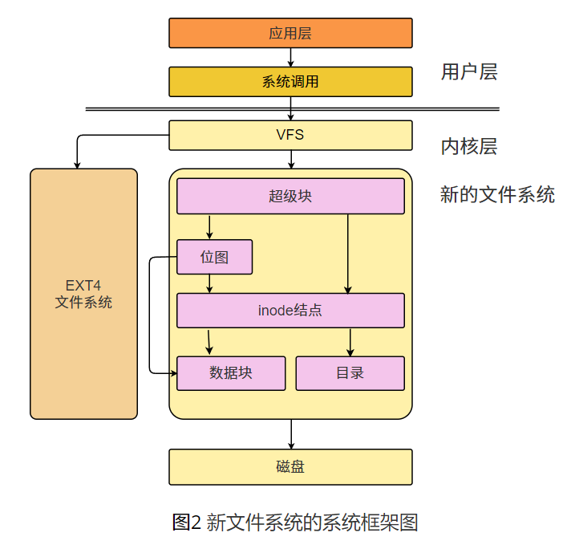
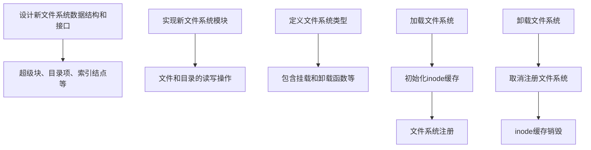
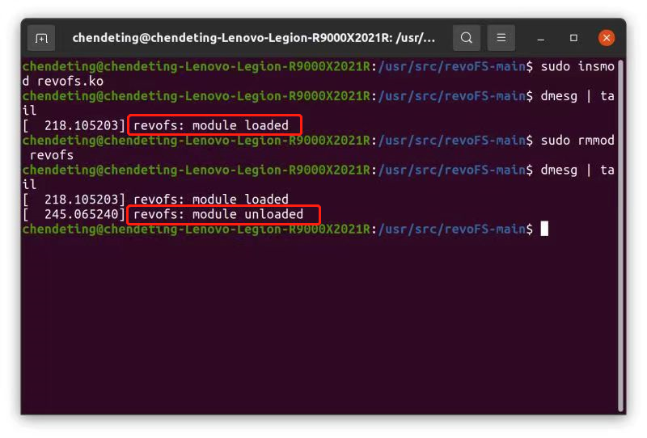
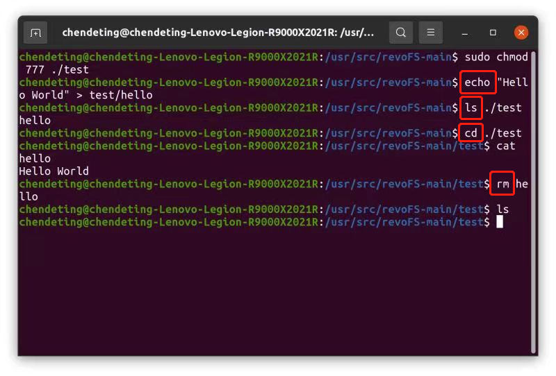
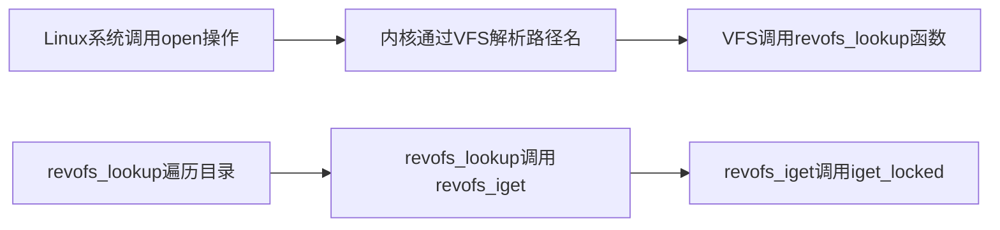
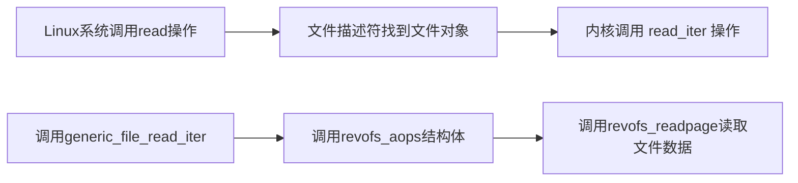

<div align = "center">   
    <h1>proj209-Linux-Custom-Filesystem</h1>
    <h2>Linux平台新文件系统的设计与优化</h2>
</div>

<div>
    <b>团队成员：陈德霆，张骁凯</b><br>
    <b>指导教师：苏曙光</b><br>
    <b>参赛学校：华中科技大学</b><br>
    <b>项目视频链接：https://pan.baidu.com/s/12arzEIjhqIRb4cXGoarT4A?pwd=ugwn</b><br>
    <b>提取码：ugwn</b><br>
</div>


## 一、目标描述

项目的基本目标是设计并实现一个新的Linux文件系统，新设计的文件系统不仅实现了传统Linux文件系统的读、写、增、删、改、查等全部功能，还实现了内核日志打印到用户空间和文件系统可视化等创新性功能。在功能上，新设计的文件系统能够支持一般Linux文件系统的全部功能，包括：**文件系统的挂载和卸载功能，文件和目录的增删读写等操作，文件权限属性控制**等。在技术细节上，创建了一个专门的Linux内核模块，用于将新设计的文件系统与现有的虚拟文件系统VFS框架进行对接，并实现了VFS框架要求的超级块、索引结点、目录（superblock、inode、dentry）等数据结构和以及相适应的读写接口。此外，还设计并实现了用户态的应用程序，用于将特定的存储设备（也可以是文件模拟的存储设备）格式化成新设计的文件系统。

赛题预定的目标有6条 <font color="#9933FF"><b>(全部已完成)</b></font> 

**目标1** <font color="#9933FF"><b>(已完成)</b></font>：实现新文件系统与Linux现有虚拟文件系统VFS之间的接口，例如：挂载、卸载（mount、unmount）等。

**目标2** <font color="#9933FF"><b>(已完成)</b></font>：实现新文件系统超级块、目录项、索引结点（superblock、dentry、inode）等核心数据结构的构建。

**目标3** <font color="#9933FF"><b>(已完成)</b></font>：实现新文件系统的权限属性，根据用户身份赋予不同的文件操作权限，例如：读、写、执行。

**目标4** <font color="#9933FF"><b>(已完成)</b></font>：实现新文件系统与用户级应用程序之间的接口，例如：打开、读、写（open、read、write）等。

**目标5** <font color="#9933FF"><b>(已完成)</b></font>：实现将块设备（例如：硬盘，软盘，也可是文件模拟的软盘）格式化为新设计的文件系统。

**目标6** <font color="#9933FF"><b>(已完成)</b></font>：设计多个用户态测试程序验证新文件系统的打开、读、写（open、read、write）等操作的正确性和稳定性。 

## 二、赛题分析和调研

本项目的核心目标在于设计并实现一个全新的文件系统，该文件系统应具备基础的文件操作功能，良好的性能和可用性，以及和用户态应用程序之间的交互。根据新的文件系统的工作原理和层次结构，项目需求分成三个主要部分。

（1）**新文件系统与Linux虚拟文件系统VFS的接口**：这是文件系统实现的核心部分，需要在新的文件系统中实现一套完整的VFS接口，以实现与Linux内核的无缝对接。这包括文件的创建、删除、读写，目录的创建、删除、遍历等基础操作，以及文件权限、硬链接和软链接等高级功能。

（2）**新文件系统硬盘存储空间的划分与管理**：考虑到文件系统是对硬盘存储空间的管理者，新的文件系统需要实现一套高效且可靠的硬盘存储管理方案。这涉及到对超级块、索引结点、目录（superblock、dentry、inode）等核心数据结构的构建，文件和目录数据的组织，以及为了提高性能和可靠性可能需要的磁盘缓存策略和数据查询策略。

（3）**新文件系统与用户态应用程序的交互接口**：虽然文件系统主要在内核空间运行，但它提供的服务主要是为用户态的应用程序所用。因此，新设计的文件系统必须通过系统调用提供一套完整的API，以满足应用程序对于文件操作的各种需求。

随后，我们进行了深入的资料调研，研究了Linux内核的文件系统框架，了解了VFS（Virtual File System，虚拟文件系统）的工作原理，以及如何将文件系统与VFS进行对接。

我们还研究了Linux内核模块的编写和加载，以及如何在用户态和内核态之间进行通信。Linux内核模块是一种可以动态加载和卸载的内核代码，它可以在不重启系统的情况下添加或删除内核功能。

在调研过程中，我们参考了许多经典的开源的Linux文件系统项目，例如`ext4`、`XFS`、`Btrfs`等。这些项目的源代码提供了宝贵的参考资料，帮助我们理解如何设计和实现一个功能完备的文件系统。

图1是新文件系统设计思路图：

<div align="center">
    
</div>

## 三、系统框架

新设计的文件系统的系统框架主要包括以下六个重要模块：

（1）**超级块（superblock）**

超级块（superblock）作为新的文件系统的元数据的核心，它携带了文件系统的全局信息，如文件系统的大小，可用空间，以及索引结点的数量等等。这些信息都是文件系统运行的关键，为文件系统的正常运行提供了基础。在新的文件系统中，超级块扮演着极其重要的角色，是文件系统管理的核心。

（2）**索引节点（inode)**

在文件系统中，每个文件或者目录都有一个对应的索引结点（inode)。索引结点包含了文件或者目录的元数据，例如：权限，所有者，大小，创建和修改时间等等。另外，索引结点还有一个重要的功能，那就是他还包含了指向文件数据的指针。

（3）**目录（Directory）**

目录（Directory）在新的文件系统中充当着文件的容器的角色。它包含了一系列的目录项，每一个目录项都是对一个文件或者子目录的索引节点（inode)的引用。因此，目录其实就是文件和子目录的索引，它让新的文件系统可以更快的访问到目标文件或者目录。

（4）**数据块（Blocks）**

数据块（Blocks）是文件系统中存储文件数据的基本单位。每一个数据块都有一个固定的大小，在新设计的文件系统中，这个大小被设置为4K。文件数据会被切分成多个块，然后分别存储在这些数据块中。

（5) **位图（Bitmaps）**

位图（Bitmaps）是一个非常实用的工具，它用来管理索引节点（inode)和数据块（Blocks）的使用情况。例如，索引节点位图中的每一位都对应一个索引节点，如果这个索引节点被使用了，那么相应的位就会被设置为1，否则就是0。数据块位图的工作方式与此类似。

  (6) **VFS接口（VFS Interface）**

为了让新设计的文件系统能在Linux中运行，需要实现一系列的VFS接口函数。这些函数包括读、写（read、write）文件，创建、删除目录（mkdir、rmdir）等等。通过实现这些接口，新设计的文件系统能够成功地与Linux内核进行交互。

这六个模块的一起构成了新文件系统的框架。在实现这些模块的过程中，一些关键的设计问题，如空间和时间效率的权衡，可靠性和安全性问题始终贯穿于整个系统框架设计中。

图2是新文件系统的系统框架图：

<div align="center">
    
</div>


## 四、设计开发计划

在开始设计和实现新文件系统项目之前制定了详细的设计开发计划。以下是主要开发步骤：

### 1. 设计文件系统的数据结构和接口

首先设计了文件系统的基本数据结构，包括超级块、目录项、索引结点（superblock、dentry、inode）等。这些数据结构是文件系统的基础，它们定义了文件系统中的文件和目录的属性和行为。此外，还设计了文件系统的接口，包括文件和目录的创建、删除、读写等操作。

在新设计的文件系统代码中，定义了一个名为`revofs`的文件系统类型，它包含了自定义的挂载和卸载函数，以及其他一些文件系统特有的属性。当新设计的文件系统被加载时，`revofs_init`函数会被调用，它首先初始化inode缓存，然后注册文件系统。当文件系统被卸载时，`revofs_exit`函数会被调用，它会取消注册我们的文件系统，并销毁inode缓存。

图3是新文件系统的设计和实现图：



<div align="center">
    <b>图三 新文件系统的设计和实现图</b>
</div>																								


该流程图描述了设计和实现文件系统的过程，包括设计文件系统的数据结构和接口，定义文件系统类型，以及加载和卸载文件系统的过程。

### 2. 实现文件系统模块

在设计了数据结构和接口之后，开始实现文件系统模块。文件系统模块是运行在Linux内核态的部分，它负责处理文件和目录的读写操作。我们实现了超级块、目录项、索引结点（superblock、dentry、inode）的读写操作，并将新创建的文件系统的操作接口与VFS进行对接。

代码文件`fs.c`包含了文件系统模块的实现。主要的函数包括：

- `revofs_mount`：挂载revofs分区
- `revofs_kill_sb`：卸载revofs分区
- `revofs_init`：初始化revofs，包括创建inode缓存和注册文件系统
- `revofs_exit`：退出revofs，包括卸载文件系统和销毁inode缓存

这些函数实现了文件系统模块的基本功能，包括挂载和卸载文件系统，以及初始化和退出文件系统。

### 3. 设计并实现用文件系统格式化工具

实现了一个用户态应用程序工具，该程序能够将一个块设备（可以用文件模拟）格式化成我们设计的文件系统的格式。这个应用程序运行在用户态，可以直接由用户操作。

该程序工具的主要功能是将块设备格式化成文件系统格式，这样用户就可以在该应用程序中创建文件和目录，进行读写操作。

这涉及到对超级块、索引结点、目录（superblock、dentry、inode）等关键数据结构的初始化配置。

图4是新文件系统格式化流程图：


<div align="center">
    <b>图4 新文件系统格式化流程图</b>
</div>

以下是代码文件`mkfs.c`的核心内容。这个文件包含了文件系统格式化的实现。主要的函数包括：

- `write_superblock()`：初始化和写入文件系统的元数据，包括块和节点的数量等。
- `write_inode_store()`：初始化和写入inode存储区块，包括设置根inode。
- `write_ifree_blocks()`：初始化和写入inode空闲位图，标记空闲和使用的inode。
- `write_bfree_blocks()`：初始化和写入块空闲位图，标记空闲和使用的块。
### 4. 编写测试用例

在实现了文件系统模块和用户态应用程序之后，我们设计了的自动化配置的测试脚本，来展示我们文件系统的功能以及整个生命周期，以及用于验证文件系统的功能。测试脚本包括文件和目录的创建、删除、读写，以及文件权限的设置和检查。

通过这个设计开发计划，成功地实现了一个可以进行文件和目录的读写操作的Linux文件系统。文件系统在所有测试用例下都表现良好，证明了设计和实现是正确的。

## 五、比赛过程中的重要进展 

| 时间 | 计划与进度                                                   |
| ---- | ------------------------------------------------------------ |
| 四月 | 将新创建的文件系统的操作接口与VFS进行了对接，这是一个重要的里程碑，因为它使文件系统能够与Linux内核进行交互。进一步实现了新的文件系统的超级块、目录、索引结点的读写操作，这些是文件系统的基础，它们定义了文件系统中的文件和目录的属性和行为。 |
| 五月 | （1）实现了新的文件系统的权限属性，不同的用户可以有不同的操作属性，增加了文件系统的安全性和灵活性。<br>（2）成功地实现了与用户态程序的对接，这使得用户程序可以直接与我们的文件系统进行交互。<br>（3）设计并实现了一个用户态应用程序，该程序可以将一个块设备（可以用文件模拟）格式化成我们设计的文件系统的格式。 |
| 六月 | 设计了一个用户态的测试用例应用程序，用于测试和验证文件系统的打开、读、写、查看目录、进入目录等常见文件系统访问操作。这个应用程序对文件系统进行了全面的测试，确保了其稳定性和可靠性。 |
| 七月 | 增添了新设计的文件系统`./`和`../`两个特殊的文件项，这两个特殊文件项目在linux系统中有着重要的作用，它们分别代表当前目录和上级目录。 |
| 八月 | 对新设计的文件系统进行了最后的检查和调整，修复了一些小的bug，并进行了一轮全面的系统测试。新设计的文件系统现在已经可以稳定运行，并且拥有不错的性能效率。我们将继续优化新设计的文件系统，引入更多的高级功能，提供更好的服务。 |

## 六、系统测试情况

新设计的文件系统一共有以下六个功能，新文件系统与Linux现有虚拟文件系统VFS之间的接口实现，新文件系统超级块、目录项、索引结点等核心数据结构的构建，新文件系统的权限属性，根据用户身份赋予不同的文件操作权限，新文件系统与用户级应用程序之间的接口设计，新文件系统将块设备（例如：硬盘，软盘，也可是文件模拟的软盘）格式化为新设计的文件系统和自动化的新文件系统测试脚本。

为了验证文件系统的完整性和正确性，我们开发了50多个功能测试用例。实验结果验证了新的文件系统成功地实现了各个预定的功能，表现出良好的性能和稳定。

赛题预定的目标有6条 <font color="#9933FF"><b>(全部已完成)</b></font> ：

**目标1** <font color="#9933FF"><b>(已完成)</b></font>：实现新文件系统与Linux现有虚拟文件系统VFS之间的接口，例如：挂载、卸载（mount、unmount）等。

**目标2** <font color="#9933FF"><b>(已完成)</b></font>：实现新文件系统超级块、目录项、索引结点（superblock、dentry、inode）等核心数据结构的构建。

**目标3** <font color="#9933FF"><b>(已完成)</b></font>：实现新文件系统的权限属性，根据用户身份赋予不同的文件操作权限，例如：读、写、执行。

**目标4** <font color="#9933FF"><b>(已完成)</b></font>：实现新文件系统与用户级应用程序之间的接口，例如：打开、读、写（open、read、write）等。

**目标5** <font color="#9933FF"><b>(已完成)</b></font>：实现将块设备（例如：硬盘，软盘，也可是文件模拟的软盘）格式化为新设计的文件系统。

**目标6** <font color="#9933FF"><b>(已完成)</b></font>：设计多个用户态测试程序验证新文件系统的打开、读、写（open、read、write）等操作的正确性和稳定性。 

### （1）目标1的测试（新文件系统的挂载、卸载）

> 目标1：实现新文件系统与Linux现有虚拟文件系统VFS之间的接口，例如：挂载、卸载（mount、unmount）等。

##### 用户输入：

在源代码目录下先编译再执行`insmod`和`rmmod`命令，以进行文件系统的挂载和卸载操作。

##### 期望输出：

文件系统的挂载和卸载操作都成功执行（在内核日志中显示出挂载、卸载消息）。

##### 实际输出：

<div align="center">
    
</div>

可以观察到，文件系统的挂载和卸载操作都成功执行，说明新文件系统与VFS之间的接口已经成功实现。

在`fs.c`文件中包含了新文件系统与虚拟文件系统VFS之间的接口实现。这个接口的实现主要包括两个部分：挂载和卸载。

挂载函数`revofs_mount`主要负责将新文件系统挂载到指定的设备上。这个函数首先调用`mount_bdev`函数，该函数接收文件系统类型、标志、设备名和数据等参数，并返回一个目录项（dentry）。如果返回的目录项出错，函数会打印出错信息；否则，函数会打印挂载成功的信息。

卸载函数`revofs_kill_sb`负责卸载新文件系统。这个函数调用`kill_block_super`函数来卸载文件系统，并打印卸载信息。

在`revofs_init`函数中，新的文件系统类型`revofs_file_system_type`被注册到系统中。这个文件系统类型包括了文件系统的名称、挂载函数、卸载函数等信息。

在`revofs_exit`函数中，文件系统类型`revofs_file_system_type`被从系统中注销。

上述测试表明，新文件系统实现了预期的文件系统的挂载和卸载目标，并表现出良好的稳定性。

### 2. 目标2的测试（新文件系统的读、写等功能）

> 目标2：实现新文件系统超级块、目录项、索引结点（superblock、dentry、inode）等核心数据结构的构建。

##### 用户输入：

加载文件模块后，创建文件并写入字符（echo），显示文件目录（ls)，进入目录（cd），读取文件（cat），删除文件（rm）等文件操作。

##### 期望输出：

文件的写入、文件读取、文件显示、进入文件目录、文件删除等操作都被正确执行，说明了新文件系统超级块、目录项、索引结点等核心数据结构的正确构建。

##### 实际输出：

<div align="center">
    
</div>

可以观察到，创建文件并写入字符（echo），显示文件目录（ls)，进入目录（cd），读取文件（cat），删除文件（rm）等文件操作都被正确执行，说明了新文件系统超级块、目录项、索引结点（superblock、dentry、inode）等核心数据结构的正确构建。

在代码中，`super.c`文件中实现了一些关于superblock的操作。例如，`revofs_write_inode`函数实现了inode的写操作，`revofs_fill_super`函数则是用于填充superblock的函数。这些函数的正确性是非常重要的，因为它们是文件系统的基础。

我们可以通过创建新的文件，然后使用`revofs_write_inode`函数来写入inode，然后再读取出来，检查写入的数据和读取的数据是否一致，来测试这个函数的正确性。

同样的，我们也可以通过创建一个新的文件系统，然后填充superblock，然后再读取出来，检查填充的数据和读取的数据是否一致，来测试`revofs_fill_super`函数的正确性。

对于目录项的读写操作，我们可以在`inode.c`文件中找到相关的实现。我们可以通过类似的方式来进行测试。

这些测试可以帮助我们确保新文件系统的基本操作是正确的，这是实现一个稳定可用的文件系统的基础。

上述测试表明，新文件系统实现了预期的文件系统超级块、目录项、索引结点（superblock、dentry、inode）等核心数据结构的构建，并表现出良好的稳定性。

### 3. 目标3的测试（新文件系统的权限属性设置）

> 目标3：实现新文件系统的权限属性，根据用户身份赋予不同的文件操作权限，例如：读、写、执行。

##### 用户输入：

加载文件模块后，启动测试脚本`pri.sh`（该脚本会在root权限下创建了一个文件test1，然后切换其他用户试图在test1写入字符)。

##### 期望输出： 

其他用户试图在test1文件写入字符时，访问失败，文件的写入权限不够。

##### 实际输出：

<div align="center">
    
</div>

启动测试脚本`pri.sh`，首先会在root权限下创建了一个文件test1，用ls命令可以查看当前文件的读写权限，当其他用户试图在test1写入字符时，该操作是不允许的。可以看到，访问失败，权限不够，权限测试结果符合预期。

权限测试脚本的关键代码部分：

```shell
...
# 执行一些文件系统操作
echo -e "\n"
echo "准备完成，开始执行文件系统操作..."
sudo su <<EOF
echo -e "\n"
echo  "×××××××××××××××××××××××××××××××××××××××××××××××××"
# 在root下创建多个测试文件测试权限操作
    echo "在root用户权限下创建文件test1"
    echo "命令：echo \"OSCOMP2023\" > /mnt/test/test1"
    echo "OSCOMP2023" > /mnt/test/test1
    ls -lR /mnt/test
    echo -e "\n"
exit
EOF
echo "尝试在普通用户权限下写入test1文件"
echo "echo \"write test\" >>/mnt/test/hello" 
echo "write test" >>/mnt/test/hello 
echo "访问失败，权限不足"
echo  "×××××××××××××××××××××××××××××××××××××××××××××××××"
echo "权限操作验证成功"
...
```

上述测试表明，新文件系统实现了预期的文件系统关于读、写、执行等文件权限属性的管理，表现出了对文件安全性的良好执行。

### 4. 目标4的测试（应用程序对新文件系统的读、写）

> 目标4：实现新文件系统与用户级应用程序之间的接口，例如：打开、读、写（open、read、write）等。

##### 用户输入：

在新文件系统格式化后，执行挂载命令

```
sudo mount -o loop -t revofs test.img /mnt/test
```

##### 期望输出：

对新文件系统的创建并写入文件（echo），读取文件（cat），显示文件目录（ls)，进入目录（cd），删除文件（rm）等文件操作都被正确执行

##### 实际输出：

<div align="center">
    
</div>

可以观察到，创建并写入文件，读取文件，显示文件目录，进入目录，删除文件等文件操作都被正确执行，说明了新文件系统实现了与用户级应用程序之间的接口。

在用户态程序和文件系统进行交互时，用户态程序主要通过系统调用（System Calls）来访问文件系统的功能。Linux内核提供了许多系统调用，如`open`，`read`，`write`，`mkdir`等，以供用户态程序访问文件系统。

在revofs文件系统中，`revofs_inode_ops`和`revofs_dir_ops`结构定义了文件和目录的操作，这些操作实现了对应的系统调用。例如，`revofs_inode_ops`结构中的`create`字段是一个函数指针，这个函数实现了创建文件的功能，当用户态程序调用`open`系统调用创建文件时，就会执行这个函数。

`revofs_inode_ops`和`revofs_dir_ops`结构体的定义：

```c
static const struct inode_operations revofs_inode_ops = {
    .lookup = revofs_lookup,
    .create = revofs_create,
    .unlink = revofs_unlink,
    .mkdir = revofs_mkdir,
    .rmdir = revofs_rmdir,
    .rename = revofs_rename,
    .link = revofs_link,
    .symlink = revofs_symlink,
};

static const struct file_operations revofs_dir_ops = {
    .owner = THIS_MODULE,
    .iterate = revofs_iterate,
};
```

在这些操作函数的实现中，会处理用户态程序的请求，比如读写数据，创建或删除文件等。这些函数通常会检查参数的有效性，然后根据文件系统的内部结构对数据进行读写，或者修改文件系统的数据结构。

使用mount命令挂载新的文件系统之后,便可以像一般文件系统一样，通过接口命令简单的使用revofs文件系统了。

根据以上测试，新文件系统成功实现了预期的文件操作（打开、读取、写入等），并且能够与用户级应用程序正常交互，显示出良好的稳定性和可靠性。

### 5. 目标5的测试（新文件系统的格式化）

> 目标5：实现将块设备（例如：硬盘，软盘，也可是文件模拟的软盘）格式化为新设计的文件系统。
##### 用户输入：

加载文件模块后,创建文件模拟的软盘

```
sudo mkdir -p /mnt/test
dd if=/dev/zero of=test.img bs=1M count=50
```

对模拟盘`test.img`执行格式化工具程序`mkfs.revofs`。

```
./mkfs.revofs test.img
```

##### 期望输出：

文件模拟的软盘被成功格式化，并显示了超级块、索引结点、数据块（superblock、inode、blocks）等结构体的信息。

##### 实际输出：

<div align="center">
    
</div>

可以观察到，该文件模拟的软盘被成功格式化，并显示了超级块、索引结点、数据块（superblock、inode、blocks）等结构体的信息。

在`mkfs.c`这个文件系统格式化源码文件中，首先对超级块（superblock）、i节点存储区、i节点空闲位图以及数据块空闲位图等关键文件系统数据结构进行初始化，并将它们写入到指定的块设备中，实现了把块设备格式化为新的文件系统的目标。

```c
/* 写入超级块（块0） */
struct superblock *sb = write_superblock(fd, &stat_buf);
/* 写入inode存储块（从块1开始） */
ret = write_inode_store(fd, sb);
/* 写入inode空闲位图块 */
ret = write_ifree_blocks(fd, sb);
/* 写入块空闲位图块 */
ret = write_bfree_blocks(fd, sb);
/* 写入数据块 */
ret = write_data_blocks(fd, sb);
```

上述测试表明，该格式化程序实现了将块设备（例如：硬盘，软盘，也可是文件模拟的软盘）格式化为新设计的文件系统的功能。这一功能是文件系统实现的重要环节，它使我们的文件系统能够在实际的存储设备上运行，为文件存储提供支持。

### 6. 目标6的测试（验证测试脚本对文件系统的读、写等功能）

> 目标6：设计多个用户态测试程序验证新文件系统的打开、读、写（open、read、write）等操作的正确性和稳定性。 

##### 用户输入：

加载文件模块后，启动测试脚本`setup.sh`（该脚本会自动执行一系列的文件操作测试)。

##### 期望输出：

新文件系统的挂载和卸载，文件的读、写、增、删、改、查等功能符合预期执行。

##### 实际输出：

<div align="center">
    
</div>


可以观察到，该脚本创建了一个`fstest`文件，并成功向该文件读写字符串，最后成功删除该文件，测试内容包括但不限于新文件系统的挂载和卸载，文件的读、写、增、删、改、查等功能。

涉及到的程序流程图见下

1. Linux系统调用open操作


2. Linux系统调用read操作



上述测试表明，测试脚本成功创建了文件，并成功向该文件中写入和读取字符串，证明了新设计的文件系统的文件创建、读、写、删除等功能的正确实现。

这验证了新设计的文件系统能够在实际的环境中运行，并且能够处理常见的文件操作。同时，由于测试脚本对文件操作的覆盖面广，增进了对新设计的文件系统的稳定性和可靠性的了解。

## 七、遇到的主要问题和解决方法

在revoFS项目的开发过程中，我们遇到了一些挑战性的问题，但通过团队合作和深入研究，成功地解决了这些问题。

### Q1:用户态和内核态之间如何传递信息以进行有效通信？

在设计和实现文件系统时，需要在用户态应用程序和内核态文件系统模块之间进行通信。这是一个复杂的问题，因为用户态和内核态有不同的地址空间，不能直接进行数据交换。通过研究Linux内核的系统调用机制，了解了如何在用户态和内核态之间传递信息。我们设计了一套接口，通过这套接口，用户态应用程序可以发送请求到内核态文件系统模块，内核态文件系统模块可以返回结果到用户态应用程序。

### Q2: 如何在新文件系统中为文件和目录添加读、写、执行等权限属性？

在实现文件系统的过程中，需要处理文件和目录的权限属性。这是一个挑战，因为权限属性涉及到许多复杂的问题，例如用户和组的管理，以及读、写、执行的权限控制。通过研究Linux内核的权限管理机制，了解了如何处理文件系统的权限属性。我们实现了一个权限管理模块，这个模块可以正确地处理文件和目录的权限属性。

### Q3: 如何实现新文件系统与应用程序之间更灵活，更具扩展性的接口设计？

设计文件系统的数据结构和接口是一个复杂的任务，因为它需要考虑到许多因素，例如文件和目录的组织方式，以及文件和目录的读写操作。通过阅读大量的技术文档和论文，以及参考其他开源的Linux文件系统项目，了解了如何设计文件系统的数据结构和接口。我们设计了一套高效且易用的数据结构和接口，使得文件系统可以正确且高效地进行文件和目录的读写操作。

通过解决这些问题，不仅提高了我们的技术能力，也增强了团队协作能力。期待在未来的项目中继续面对并解决更多的挑战。

## 八、分工和协作

我们的团队成员分工明确，协作紧密，共同参与了文件系统的设计和实现，每个人都在自己的领域内发挥了重要作用。

| 功能点             | 负责人          | 备注 |
| ------------------ | --------------- | :--: |
| 比赛选题规划    | 苏曙光老师      | 无   |
| 框架设计指导    | 苏曙光老师      | 无   |
| 超级块（superblock）结构设计| 陈德霆 / 张骁凯 | 无   |
| 索引节点（inode)结构设计| 陈德霆 / 张骁凯 | 无   |
| 项目文档的撰写     | 陈德霆 / 张骁凯 | 无   |
| 测试脚本的编写  | 陈德霆 / 张骁凯 | 无   |
| 目录结构体的设计 | 陈德霆 | 无   |
| 文件的增、删、读、写（touch、rm、read、write）等功能设计 | 陈德霆 | 无   |
|文件权限属性（读、写、执行）的增、删、改| 张骁凯  | 无   |
|文件系统格式化工具的编写| 张骁凯  | 无   |


## 九、提交仓库目录和文件描述

代码和文档都存储Gitlab仓库中。以下是仓库目录和文件描述：

```
.revoFS/						
│  README.md                //项目说明文件
│  README.pdf               //项目说明文件PDF版本
├─code                      //项目源代码和相关文件
│      revofs.h	            //项目的主要头文件
│      bitmap.h	            //位图操作相关的头文件
│      dir.c                //目录操作相关的函数实现文件
│      extent.c             //扩展操作相关的函数实现文件
│      file.c               //文件操作相关的函数实现文件
│      fs.c                 //文件系统操作的函数实现文件
│      super.c              //超级块操作相关的函数实现文件
│      hello1               //测试脚本创建的文件
│      inode.c              //索引节点操作函数实现文件
│      Makefile             //自动编译和链接项目文件
│      mkfs.c               //文件系统格式化函数实现文件
│      pri.sh               //用于测试文件权限的脚本一
│      rw_test.sh           //用于测试读写的脚本二。
│      setup.sh             //用于测试完整流程的脚本三
└─pics                      //图片
```

## 十、比赛收获

参加这次比赛，收获颇丰。以下是我们的主要收获：

### 1. 深入理解Linux文件系统

通过设计和实现revoFS项目，我们深入了解了Linux文件系统的工作原理，学习了如何设计文件系统的数据结构和接口，如何实现文件系统模块，以及如何在用户态和内核态之间进行通信。这些知识不仅对我们的项目有所帮助，也对未来学习和工作有所帮助。

### 2. 提高编程和问题解决能力

在项目的开发过程中，我们遇到了许多挑战性的问题。通过查阅相关资料，进行实验，以及团队讨论，成功地解决了这些问题。这个过程提高了编程能力和问题解决能力。

### 3. 提升团队协作能力

在这个项目中，需要与团队成员紧密合作，共同完成任务。我们学习了如何有效地分配任务，如何进行有效的沟通，以及如何协调团队成员的工作。这个过程提升了团队协作能力。

### 4. 学习如何使用开源工具

在这个项目中，使用了许多开源工具，例如GitHub。我们学习了如何使用这些工具进行代码管理，如何进行版本控制，以及如何进行代码审查。这些技能对未来学习和工作都非常有用。

总的来说，通过参加这次比赛，不仅提高了技术能力，也增强了团队协作能力。期待在未来的比赛中继续学习和进步。