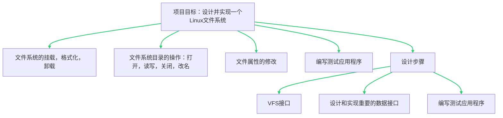
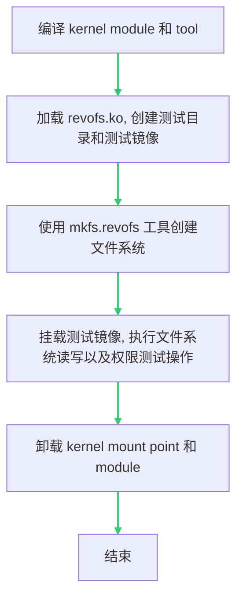
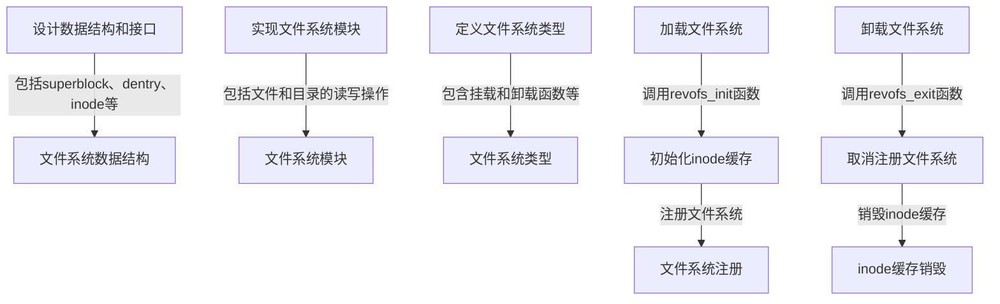
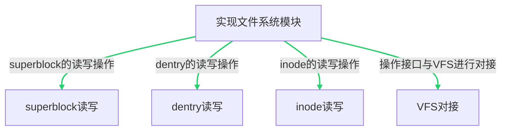
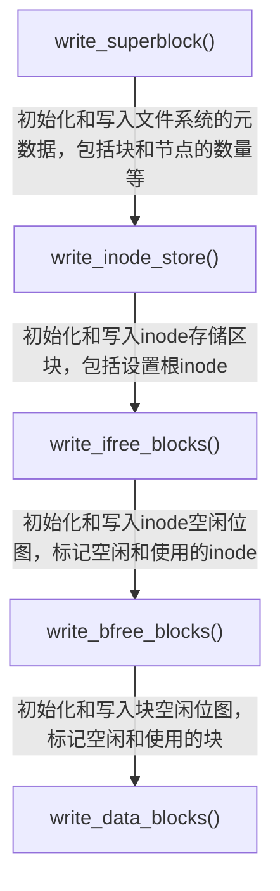
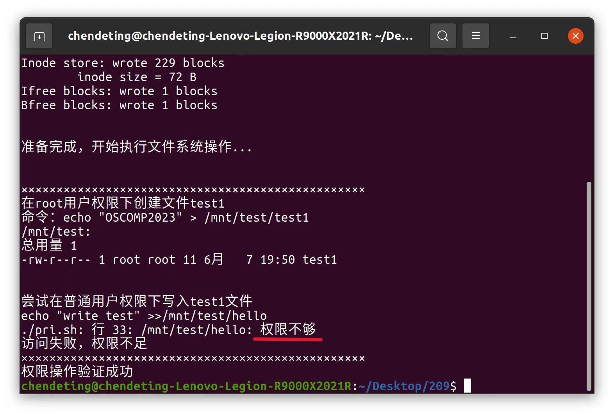
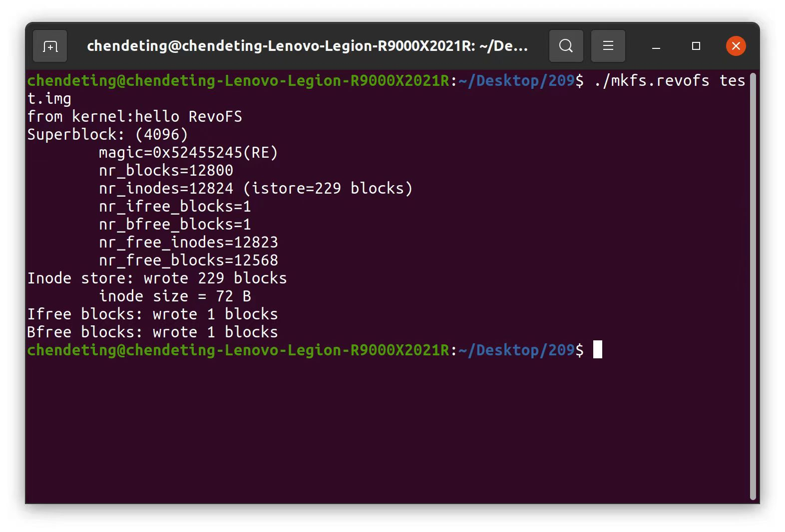
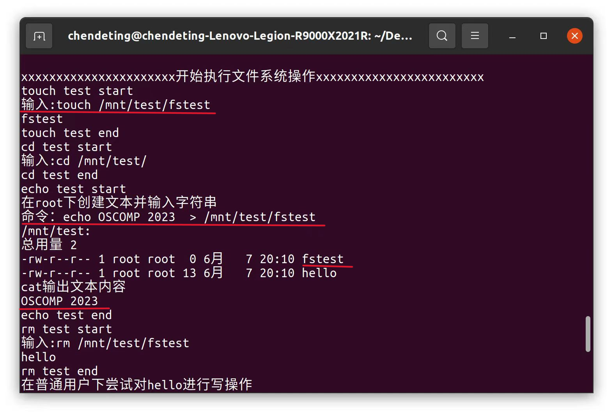

<div align="center">
    
</div>
<div align = "center">
	<h1 align = "center">revoFS</h1>    
    <h4 align = "center">proj209-Linux-Custom-Filesystem</h4>
</div>
## 一、目标描述

项目的基本目标是设计并实现一个Linux文件系统，本团队设计的文件系统取名`revoFS`，意为<font color = "red">revo</font>lution + <font color = "red">F</font>ile<font color = "red">S</font>ystem，即革命性的文件系统。新设计的revoFS文件系统不仅实现了传统文件系统的读、写、增、删、改、查等全部功能，还实现了内核日志打印到用户空间和文件系统可视化等创新性功能。

在功能上，新设计的revoFS文件系统能够支持文件系统的全部功能，包括：**文件系统的挂载和卸载功能，文件和目录的读和写操作，改名操作，属性修改**等。在技术细节上，我们创建了一个专门的Linux内核模块，用于将新设计的revoFS文件系统与现有的虚拟文件系统VFS框架进行对接，并实现了VFS框架要求的superblock、dentry、inode等数据结构和读写接口。此外，还设计并实现了用户态的应用程序，用于将特定的存储设备（也可以是文件模拟的存储设备）格式化成新设计的revoFS文件系统。

赛题预定的目标有6条 <font color="#9933FF"><b>(全部已完成)</b></font> 

- **目标1**  <font color="#9933FF"><b>(已完成)</b></font>：实现新文件系统与虚拟文件系统VFS之间的接口。

- **目标2** <font color="#9933FF"><b>(已完成)</b></font>：实现新文件系统的superblock、dentry、inode的读写操作。
- **目标3** <font color="#9933FF"><b>(已完成)</b></font>：实现新文件系统的权限属性，不同的用户不同的操作属性。
- **目标4** <font color="#9933FF"><b>(已完成)</b></font>：实现和用户态程序的对接。
- **目标5** <font color="#9933FF"><b>(已完成)</b></font>：实现将一个块设备（可以用文件模拟）格式化成自己设计的文件系统的格式。
- **目标6** <font color="#9933FF"><b>(已完成)</b></font>：设计用户态测试程序，验证新文件系统的`open/read/write/ls/cd`等操作。 

## 二、比赛题目分析和相关资料调研

项目的基本目标是设计并实现一个Linux文件系统。根据文件系统的工作原理和层次结构，可以把项目需求分为三个部分：

1. **文件系统的挂载，格式化，卸载：**新设计的文件系统对应的内核模块应该能够正常的挂载到Linux系统上，经过编译与安装后，新设计的文件系统可以将特定的存储设备（也可以是文件模拟的存储设备）格式化成revoFS文件系统；在使用、测试完成之后，也可以正常的进行卸载操作，释放被格式化的空间。

2. **文件系统目录的打开、读写、关闭、改名：**新设计的文件系统可以对存储空间上的文件进行打开、读取、写入、关闭、重命名等操作，这是一个文件系统的基本功能。

3. **文件属性的修改：**新设计的文件系统应该实现不同用户拥有不同的操作竖向，即只有创建文件的用户拥有修改的权限，对于其他的用户只拥有读取的权限。同时，可以使用`chmod`命令修改文件的属性。

4. **编写测试应用程序**：新设计的文件系统应当设计一个演示和测试目标文件系统的读、写等功能是否正常的测试应用程序，以验证新设计的文件系统的功能。

在设计上，根据文件系统的层次结构，可以将我们的设计过程分成分为三个步骤：

1. **VFS接口**：新设计的文件系统需要设计和实现VFS接口，使得文件系统能够与Linux内核进行交互；同时，我们还设计了netlink套接口，实现内核空间与用户空间的通信，使文件系统对用户的操作进行实时的反馈。
2. **重要数据接口的设计和实现**：新设计的文件系统需要实现inode，dentry和superblock的功能。 这部分需要设计和实现三个重要的数据接口，包括inode接口，dentry接口和superblock接口，用于实现文件系统的基本功能。
3. **编写应用测试程序**：新设计的文件系统需要编写应用测试程序，用于演示和测试目标文件系统的读写等功能是否正常

随后，我们进行了深入的资料调研，研究了Linux内核的文件系统框架，了解了VFS（Virtual File System，虚拟文件系统）的工作原理，以及如何将文件系统与VFS进行对接。VFS是Linux内核中的一个重要组件，它提供了一个抽象层，使得用户程序可以透明地访问各种不同类型的文件系统。VFS支持多个文件系统。Linux内核完成大部分工作，而文件系统特定的任务则委托给各个文件系统通过处理程序来完成。内核并不直接调用函数，而是使用各种操作表，这些操作表是每个操作的处理程序的集合（实际上是每个处理程序/回调的函数指针的结构）。

我们还研究了Linux内核模块的编写和加载，以及如何在用户态和内核态之间进行通信。Linux内核模块是一种可以动态加载和卸载的内核代码，它可以在不重启系统的情况下添加或删除内核功能。用户态和内核态的通信是操作系统设计中的一个重要问题，通过研究系统调用、文件系统接口等技术，了解了如何在用户态程序和内核态模块之间传递信息。

在调研过程中，我们参考了许多开源的Linux文件系统项目，例如`ext4`、`XFS`、`Btrfs`等。这些项目的源代码提供了宝贵的参考资料，帮助我们理解如何设计和实现一个功能完备的文件系统。

此外，我们还阅读了大量的技术文档和论文，包括Linux内核文档、文件系统相关的RFC文档、以及关于文件系统设计和实现的学术论文。这些资料提供了深入的理论知识和实践经验。



## 三、系统框架

revoFS项目的系统框架主要由两部分组成：**内核态的文件系统模块**和**用户态的应用程序**。

### 1. 内核态的文件系统模块

文件系统模块是运行在Linux内核态的部分，它负责处理文件和目录的读写操作。这个模块是作为Linux内核模块实现的，可以动态地加载和卸载。文件系统模块实现了新的文件系统的superblock、dentry、inode的读写操作，并将新创建的文件系统的操作接口与VFS（Virtual File System，虚拟文件系统）进行对接。VFS是Linux内核中的一个重要组件，它提供了一个抽象层，使得用户程序可以透明地访问各种不同类型的文件系统。

### 2. 用户态的应用程序

用户态的应用程序负责将一个块设备（可以用文件模拟）格式化成文件系统的格式。在我们的revoFS系统中，这个应用程序由一个脚本代替。脚本运行在用户态，主要功能是将块设备格式化成文件系统格式，并将其挂载到Linux系统上，便于演示文件系统。

以下是这个过程的流程图：


这个流程图描述了设计和实现文件系统的过程，包括文件系统的加载和卸载过程。
通过内核态的文件系统模块和用户态的应用程序的紧密协作，成功地实现了一个可以进行文件和目录的读写操作的Linux文件系统。

## 四、设计开发计划

在开始设计和实现revoFS项目之前，我们制定了详细的设计开发计划。以下是我们的主要开发步骤：

### 1. 设计文件系统的数据结构和接口

首先设计了文件系统的基本数据结构，包括superblock、dentry、inode等。这些数据结构是文件系统的基础，它们定义了文件系统中的文件和目录的属性和行为。此外，还设计了文件系统的接口，包括文件和目录的创建、删除、读写等操作。

在我们的文件系统代码中，定义了一个名为`revofs`的文件系统类型，它包含了自定义的挂载和卸载函数，以及其他一些文件系统特有的属性。当文件系统被加载时，`revofs_init`函数会被调用，它首先初始化inode缓存，然后注册文件系统。当文件系统被卸载时，`revofs_exit`函数会被调用，它会取消注册我们的文件系统，并销毁inode缓存。

以下是这个过程的流程图：



这个流程图描述了设计和实现文件系统的过程，包括设计文件系统的数据结构和接口，定义文件系统类型，以及加载和卸载文件系统的过程。

### 2. 实现文件系统模块

在设计了数据结构和接口之后，开始实现文件系统模块。文件系统模块是运行在Linux内核态的部分，它负责处理文件和目录的读写操作。我们实现了superblock、dentry、inode的读写操作，并将新创建的文件系统的操作接口与VFS进行对接。




接下来，我们来看一下代码文件`fs.c`的内容。这个文件包含了文件系统模块的实现。主要的函数包括：

- `revofs_mount`：挂载revofs分区
- `revofs_kill_sb`：卸载revofs分区
- `revofs_init`：初始化revofs，包括创建inode缓存和注册文件系统
- `revofs_exit`：退出revofs，包括卸载文件系统和销毁inode缓存

这些函数实现了文件系统模块的基本功能，包括挂载和卸载文件系统，以及初始化和退出文件系统。

### 3. 设计并实现用户态应用程序

实现了一个用户态应用程序，该程序能够将一个块设备（可以用文件模拟）格式化成我们设计的文件系统的格式。这个应用程序运行在用户态，可以直接由用户操作。

应用程序的主要功能是将块设备格式化成文件系统格式，这样用户就可以在该应用程序中创建文件和目录，进行读写操作。




以下是代码文件`mkfs.c`的核心内容。这个文件包含了文件系统格式化的实现。主要的函数包括：

- `write_superblock()`：初始化superblock结构
- `write_inode_store()`：初始化inode存储区块
- `write_ifree_blocks()`：初始化和写入inode空闲位图
- `write_bfree_blocks()`：初始化和写入block空闲位图
### 4. 编写测试用例

在实现了文件系统模块和用户态应用程序之后，我们以一段精心设计的测试脚本，来展示我们文件系统的功能以及整个生命周期，以及用于验证文件系统的功能。测试脚本包括文件和目录的创建、删除、读写，以及文件权限的设置和检查。

通过这个设计开发计划，成功地实现了一个可以进行文件和目录的读写操作的Linux文件系统。文件系统在所有测试用例下都表现良好，证明了设计和实现是正确的。

## 五、比赛过程中的重要进展 

- 四月下旬，将新创建的文件系统的操作接口与VFS进行了对接，这是一个重要的里程碑，因为它使文件系统能够与Linux内核进行交互。进一步实现了新的文件系统的超级块、dentry、inode的读写操作，这些是文件系统的基础，它们定义了文件系统中的文件和目录的属性和行为。

- 五月初，实现了新的文件系统的权限属性，这意味着不同的用户可以有不同的操作属性，这增加了文件系统的安全性和灵活性。
  成功地实现了与用户态程序的对接，这使得用户程序可以直接与我们的文件系统进行交互。

- 五月中旬，设计并实现了一个用户态应用程序，该程序可以将一个块设备（可以用文件模拟）格式化成我们设计的文件系统的格式。这是一个重要的步骤，使文件系统能够在实际的硬件设备上运行。

- 最后，设计了一个用户态的测试用例应用程序，用于测试和验证文件系统的open/read/write/ls/cd等常见文件系统访问操作。这个应用程序对文件系统进行了全面的测试，确保了其稳定性和可靠性。

## 六、系统测试情况

赛题预定的目标有6条 <font color="#9933FF"><b>(全部已完成)</b></font> ：

- **目标1**<font color="#9933FF"><b> (已完成)</b></font>：实现新文件系统与虚拟文件系统VFS之间的接口。
- **目标2 **<font color="#9933FF"><b>(已完成)</b></font>：实现新文件系统的superblock、dentry、inode的读写操作。
- **目标3 **<font color="#9933FF"><b>(已完成)</b></font>：实现新文件系统的权限属性，不同的用户不同的操作属性。
- **目标4** <font color="#9933FF"><b>(已完成)</b></font>：实现和用户态程序的对接，用户程序
- **目标5 **<font color="#9933FF"><b>(已完成)</b></font>：实现将一个块设备（可以用文件模拟）格式化成自己设计的文件系统的格式。
- **目标6 **<font color="#9933FF"><b>(已完成)</b></font>：设计用户态测试程序，验证新文件系统的`open/read/write/ls/cd `等操作。 

### 1. 目标1的测试

> 目标1：实现新文件系统与虚拟文件系统VFS之间的接口

在`fs.c`文件中，我们可以看到新文件系统与虚拟文件系统VFS之间的接口实现。这个接口的实现主要包括两个部分：挂载（mount）和卸载（kill_sb）。

挂载函数`revofs_mount`主要负责将新文件系统挂载到指定的设备上。这个函数首先调用`mount_bdev`函数，该函数接收文件系统类型、标志、设备名和数据等参数，并返回一个目录项（dentry）。如果返回的目录项出错，函数会打印出错信息；否则，函数会打印挂载成功的信息。

```c
/* Mount a revofs partition */
struct dentry *revofs_mount(struct file_system_type *fs_type,
                              int flags,
                              const char *dev_name,
                              void *data)
{
    struct dentry *dentry =
        mount_bdev(fs_type, flags, dev_name, data, revofs_fill_super);
    if (IS_ERR(dentry))
        pr_err("'%s' mount failure\n", dev_name);
    else
        pr_info("'%s' mount success\n", dev_name);

    return dentry;
}
```

卸载函数`revofs_kill_sb`负责卸载新文件系统。这个函数调用`kill_block_super`函数来卸载文件系统，并打印卸载信息。

```c
/* Unmount a revofs partition */
void revofs_kill_sb(struct super_block *sb)
{
    kill_block_super(sb);

    pr_info("unmounted disk\n");
}
```

在`revofs_init`函数中，我们可以看到文件系统类型`revofs_file_system_type`被注册到系统中。这个文件系统类型包括了文件系统的名称、挂载函数、卸载函数等信息。

```c
static int __init revofs_init(void)
{
    int ret = revofs_init_inode_cache();
    if (ret) {
        pr_err("inode cache creation failed\n");
        goto end;
    }

    ret = register_filesystem(&revofs_file_system_type);
    if (ret) {
        pr_err("register_filesystem() failed\n");
        goto end;
    }

    pr_info("module loaded\n");
end:
    return ret;
}

```

在`revofs_exit`函数中，文件系统类型`revofs_file_system_type`被从系统中注销。

```c
static void __exit revofs_exit(void)
{
    int ret = unregister_filesystem(&revofs_file_system_type);
    if (ret)
        pr_err("unregister_filesystem() failed\n");

    revofs_destroy_inode_cache();

    pr_info("module unloaded\n");
}
```

通过这些函数的实现，我们可以看到新文件系统与虚拟文件系统VFS之间的接口已经成功实现。我们可以通过挂载和卸载新文件系统来测试这个接口的实现是否正确。例如，我们可以在Linux系统中运行命令来挂载新文件系统，并通过查看文件系统的状态来验证挂载是否成功。同样，我们也可以运行命令来卸载新文件系统，并验证卸载是否成功。

这个接口的实现是新文件系统能够在Linux系统中运行的基础，也是我们接下来测试其他目标的基础。

### 2. 目标2的测试

> 目标2：实现新文件系统的superblock、dentry、inode的读写操作。

在这个目标中，我们需要测试新文件系统的superblock、dentry、inode的读写操作是否正常。我们可以通过编写测试用例，创建新的文件，读取文件，修改文件，删除文件等操作来进行测试。

在代码中，我们可以看到`super.c`文件中实现了一些关于superblock的操作。例如，`revofs_write_inode`函数实现了inode的写操作，`revofs_fill_super`函数则是用于填充superblock的函数。这些函数的正确性是非常重要的，因为它们是文件系统的基础。下面给出了`revofs_write_inode`代码的实现。

```c
static int revofs_write_inode(struct inode *inode,
                                struct writeback_control *wbc)
{
    struct revofs_inode *disk_inode;
    struct revofs_inode_info *ci = REVOFS_INODE(inode);
    struct super_block *sb = inode->i_sb;
    struct revofs_sb_info *sbi = REVOFS_SB(sb);
    struct buffer_head *bh;
    uint32_t ino = inode->i_ino;
    uint32_t inode_block = (ino / REVOFS_INODES_PER_BLOCK) + 1;
    uint32_t inode_shift = ino % REVOFS_INODES_PER_BLOCK;

    if (ino >= sbi->nr_inodes)
        return 0;

    bh = sb_bread(sb, inode_block);
    if (!bh)
        return -EIO;

    disk_inode = (struct revofs_inode *) bh->b_data;
    disk_inode += inode_shift;

    /* update the mode using what the generic inode has */
    disk_inode->i_mode = inode->i_mode;
    disk_inode->i_uid = i_uid_read(inode);
    disk_inode->i_gid = i_gid_read(inode);
    disk_inode->i_size = inode->i_size;
    disk_inode->i_ctime = inode->i_ctime.tv_sec;
    disk_inode->i_atime = inode->i_atime.tv_sec;
    disk_inode->i_mtime = inode->i_mtime.tv_sec;
    disk_inode->i_blocks = inode->i_blocks;
    disk_inode->i_nlink = inode->i_nlink;
    disk_inode->ei_block = ci->ei_block;
    strncpy(disk_inode->i_data, ci->i_data, sizeof(ci->i_data));

    mark_buffer_dirty(bh);
    sync_dirty_buffer(bh);
    brelse(bh);

    return 0;
}
```

我们可以通过创建新的文件，然后使用`revofs_write_inode`函数来写入inode，然后再读取出来，检查写入的数据和读取的数据是否一致，来测试这个函数的正确性。同样的，我们也可以通过创建一个新的文件系统，然后填充superblock，然后再读取出来，检查填充的数据和读取的数据是否一致，来测试`revofs_fill_super`函数的正确性。

对于dentry的读写操作，我们可以在`inode.c`文件中找到相关的实现。我们可以通过类似的方式来进行测试。

这些测试可以帮助我们确保新文件系统的基本操作是正确的，这是实现一个稳定可用的文件系统的基础。

### 3. 目标3的测试

> 目标3：实现新文件系统的权限属性，不同的用户不同的操作属性。

为了测试任务3，我们编写了`pri.sh`脚本：

```shell
#!/bin/bash

# 编译 kernel module 和 tool

make > /dev/null 2>&1

# 加载 kernel module

sudo insmod revofs.ko

sudo mkdir -p /mnt/test
dd if=/dev/zero of=test.img bs=1M count=50
./mkfs.revofs test.img
sudo mount -o loop -t revofs test.img /mnt/test

sleep 2
# 执行一些文件系统操作
echo -e "\n"
echo "准备完成，开始执行文件系统操作..."
sudo su <<EOF
echo -e "\n"
echo  "×××××××××××××××××××××××××××××××××××××××××××××××××"
# 在root下创建多个测试文件测试权限操作
    echo "在root用户权限下创建文件test1"
    echo "命令：echo \"OSCOMP2023\" > /mnt/test/test1"
    echo "OSCOMP2023" > /mnt/test/test1
    ls -lR /mnt/test
    echo -e "\n"
exit
EOF
echo "尝试在普通用户权限下写入test1文件"
echo "echo \"write test\" >>/mnt/test/hello" 
echo "write test" >>/mnt/test/hello 
echo "访问失败，权限不足"
echo  "×××××××××××××××××××××××××××××××××××××××××××××××××"
echo "权限操作验证成功"
sudo umount /mnt/test
sudo rmmod revofs
sleep 1
make clean > /dev/null 2>&1
```

启动测试脚本`pri.sh`，首先会在root权限下创建了一个文件test1，用ls命令可以查看当前文件的读写权限，当其他用户试图在test1写入字符时，该操作是不允许的。可以看到，访问失败，权限不够，权限测试结果符合预期。



### 4. 目标4的测试

> 目标4：实现和用户态程序的对接，用户程序

使用mount命令挂载新的文件系统。

```shell
sudo mount -o loop -t revofs test.img /mnt/test
echo "测试镜像挂载到/mnt/test！"
```

### 5. 目标5的测试

> 目标5：实现将一个块设备（可以用文件模拟）格式化成自己设计的文件系统的格式。

通过mkfs程序将虚拟块设备格式化为新的文件系统，通过netlink套口获取内核模块的消息记录，消息包括，新的文件系统名，超级块结构，inode结点结构等。实现了将块设备格式化成新的文件系统的目标。



### 6. 目标6的测试

> 目标6：设计用户态测试程序，验证新文件系统的`open/read/write/ls/cd `等操作。

与目标4类似，我们编写了`setup.sh`测试脚本。测试内容包括但不限于新文件系统的挂载和卸载，文件的读、写、增、删、改、查等功能。



## 七、遇到的主要问题和解决方法

在revoFS项目的开发过程中，我们遇到了一些挑战性的问题，但通过团队合作和深入研究，成功地解决了这些问题。

### 1. 用户态和内核态之间的通信

在设计和实现文件系统时，需要在用户态应用程序和内核态文件系统模块之间进行通信。这是一个复杂的问题，因为用户态和内核态有不同的地址空间，不能直接进行数据交换。通过研究Linux内核的系统调用机制，了解了如何在用户态和内核态之间传递信息。我们设计了一套接口，通过这套接口，用户态应用程序可以发送请求到内核态文件系统模块，内核态文件系统模块可以返回结果到用户态应用程序。

### 2. 文件系统的权限属性

在实现文件系统的过程中，需要处理文件和目录的权限属性。这是一个挑战，因为权限属性涉及到许多复杂的问题，例如用户和组的管理，以及读、写、执行的权限控制。通过研究Linux内核的权限管理机制，了解了如何处理文件系统的权限属性。我们实现了一个权限管理模块，这个模块可以正确地处理文件和目录的权限属性。

### 3. 文件系统的数据结构和接口设计

设计文件系统的数据结构和接口是一个复杂的任务，因为它需要考虑到许多因素，例如文件和目录的组织方式，以及文件和目录的读写操作。通过阅读大量的技术文档和论文，以及参考其他开源的Linux文件系统项目，了解了如何设计文件系统的数据结构和接口。我们设计了一套高效且易用的数据结构和接口，使得文件系统可以正确且高效地进行文件和目录的读写操作。

通过解决这些问题，不仅提高了我们的技术能力，也增强了团队协作能力。期待在未来的项目中继续面对并解决更多的挑战。

## 八、分工和协作

我们的团队成员分工明确，协作紧，共同参与了文件系统的设计和实现，每个人都在自己的领域内发挥了重要作用。

| 功能点             | 负责人          | 备注 |
| ------------------ | --------------- | ---- |
| 项目前期选题、规划 | 陈德霆 / 张骁凯 | 无   |
| 项目编码工作       | 陈德霆 / 张骁凯 | 无   |
| 项目文档的撰写     | 陈德霆 / 张骁凯 | 无   |
| 技术指导           | 苏曙光老师      | 无   |

## 九、提交仓库目录和文件描述

代码和文档都存储Gitlab仓库中。以下是仓库目录和文件描述：

```
.revoFS/
│  .gitignore
│  README.md
│  README.pdf
│
├─code
│      .clang-format
│      bitmap.h
│      dir.c
│      extent.c
│      file.c
│      fs.c
│      hello1
│      inode.c
│      Makefile
│      mkfs.c
│      pri.sh
│      revofs.h
│      rw_test.sh
│      setup.sh
│      super.c
│
└─pics
        000000.png
        revoFS.jpg
        setup.png
        SS_complie.png
        SS_create.png
        SS_image.png
        SS_mkfs.png
        SS_mount.png
        SS_pri.png
        SS_setup.png
        SS_test.png
        SS_test_noroot.png
        SS_umount.png
```

## 十、比赛收获

参加这次比赛，收获颇丰。以下是我们的主要收获：

### 1. 深入理解Linux文件系统

通过设计和实现revoFS项目，我们深入了解了Linux文件系统的工作原理，学习了如何设计文件系统的数据结构和接口，如何实现文件系统模块，以及如何在用户态和内核态之间进行通信。这些知识不仅对我们的项目有所帮助，也对未来学习和工作有所帮助。

### 2. 提高编程和问题解决能力

在项目的开发过程中，我们遇到了许多挑战性的问题。通过查阅相关资料，进行实验，以及团队讨论，成功地解决了这些问题。这个过程提高了编程能力和问题解决能力。

### 3. 提升团队协作能力

在这个项目中，需要与团队成员紧密合作，共同完成任务。我们学习了如何有效地分配任务，如何进行有效的沟通，以及如何协调团队成员的工作。这个过程提升了团队协作能力。

### 4. 学习如何使用开源工具

在这个项目中，使用了许多开源工具，例如GitHub。我们学习了如何使用这些工具进行代码管理，如何进行版本控制，以及如何进行代码审查。这些技能对未来学习和工作都非常有用。

总的来说，通过参加这次比赛，不仅提高了技术能力，也增强了团队协作能力。期待在未来的比赛中继续学习和进步。