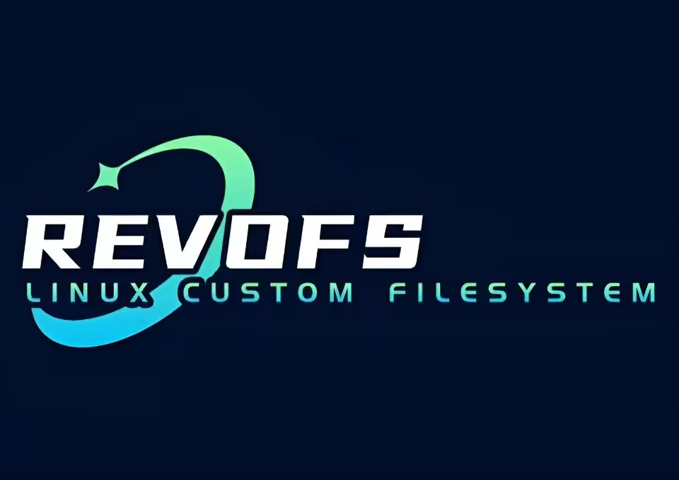
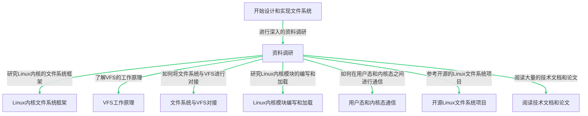

<div align="center">
    
</div>
<div align = "center">
	<h1 align = "center">revoFS</h1>    
    <h4 align = "center">proj209-Linux-Custom-Filesystem</h4>
</div>

## 一、目标描述

`revoFS`意为`revolution + FileSystem`，目标是设计并实现一个Linux文件系统，该文件系统能够进行文件和目录的读写操作。我们将创建一个Linux内核模块，该模块将新创建的文件系统的操作接口与VFS进行对接，并实现新的文件系统的superblock、dentry、inode的读写操作。此外，我们还将设计并实现一个用户态应用程序，该程序能够将一个块设备（可以用文件模拟）格式化成我们设计的文件系统的格式。

## 二、比赛题目分析和相关资料调研

在开始设计和实现我们的文件系统之前，我们进行了深入的资料调研。我们研究了Linux内核的文件系统框架，了解了VFS（Virtual File System，虚拟文件系统）的工作原理，以及如何将我们的文件系统与VFS进行对接。VFS是Linux内核中的一个重要组件，它提供了一个抽象层，使得用户程序可以透明地访问各种不同类型的文件系统。VFS支持多个文件系统。Linux内核完成大部分工作，而文件系统特定的任务则委托给各个文件系统通过处理程序来完成。内核并不直接调用函数，而是使用各种操作表，这些操作表是每个操作的处理程序的集合（实际上是每个处理程序/回调的函数指针的结构）。

我们还研究了Linux内核模块的编写和加载，以及如何在用户态和内核态之间进行通信。Linux内核模块是一种可以动态加载和卸载的内核代码，它可以在不重启系统的情况下添加或删除内核功能。用户态和内核态的通信是操作系统设计中的一个重要问题，我们通过研究系统调用、文件系统接口等技术，了解了如何在用户态程序和内核态模块之间传递信息。

在调研过程中，我们参考了许多开源的Linux文件系统项目，例如`ext4`、`XFS`、`Btrfs`等。这些项目的源代码为我们提供了宝贵的参考资料，帮助我们理解了如何设计和实现一个功能完备的文件系统。

此外，我们还阅读了大量的技术文档和论文，包括Linux内核文档、文件系统相关的RFC文档、以及关于文件系统设计和实现的学术论文。这些资料为我们提供了深入的理论知识和实践经验。



## 三、系统框架

revoFS项目的系统框架主要由两部分组成：**内核态的文件系统模块**和**用户态的应用程序**。

### 1. 内核态的文件系统模块

文件系统模块是运行在Linux内核态的部分，它负责处理文件和目录的读写操作。这个模块是作为Linux内核模块实现的，可以动态地加载和卸载。文件系统模块实现了新的文件系统的superblock、dentry、inode的读写操作，并将新创建的文件系统的操作接口与VFS（Virtual File System，虚拟文件系统）进行对接。VFS是Linux内核中的一个重要组件，它提供了一个抽象层，使得用户程序可以透明地访问各种不同类型的文件系统。

### 2. 用户态的应用程序

用户态的应用程序负责将一个块设备（可以用文件模拟）格式化成我们设计的文件系统的格式。在我们的revoFS系统中，这个应用程序由一个脚本代替。脚本运行在用户态，主要功能是将块设备格式化成我们的文件系统格式，并将其挂载到Linux系统上。便于演示我们文件系统的。

这两部分共同构成了revoFS项目的系统框架。通过内核态的文件系统模块和用户态的应用程序的紧密协作，我们成功地实现了一个可以进行文件和目录的读写操作的Linux文件系统。

## 四、设计开发计划

在开始设计和实现revoFS项目之前，我们制定了详细的设计开发计划。以下是我们的主要开发步骤：

### 1. 设计文件系统的数据结构和接口

我们首先设计了文件系统的基本数据结构，包括superblock、dentry、inode等。这些数据结构是文件系统的基础，它们定义了文件系统中的文件和目录的属性和行为。此外，我们还设计了文件系统的接口，包括文件和目录的创建、删除、读写等操作。

### 2. 实现文件系统模块

在设计了数据结构和接口之后，我们开始实现文件系统模块。文件系统模块是运行在Linux内核态的部分，它负责处理文件和目录的读写操作。我们实现了superblock、dentry、inode的读写操作，并将新创建的文件系统的操作接口与VFS进行对接。

### 3. 设计并实现用户态应用程序

我们设计并实现了一个用户态应用程序，该程序能够将一个块设备（可以用文件模拟）格式化成我们设计的文件系统的格式。这个应用程序运行在用户态，可以直接由用户操作。应用程序的主要功能是将块设备格式化成我们的文件系统格式，这样用户就可以在这个设备上创建文件和目录，进行读写操作。

### 4. 编写测试用例

在实现了文件系统模块和用户态应用程序之后，我们编写了一系列测试用例，用于验证我们的文件系统的功能。我们的测试用例包括文件和目录的创建、删除、读写，以及文件权限的设置和检查。

通过这个设计开发计划，我们成功地实现了一个可以进行文件和目录的读写操作的Linux文件系统。我们的文件系统在所有测试用例下都表现良好，证明了我们的设计和实现是正确的。

## 五、比赛过程中的重要进展

在比赛过程中，我们成功地实现了文件系统模块，并在用户态应用程序中完成了块设备的格式化。我们还编写了一系列测试用例，验证了我们的文件系统的功能。

## 六、系统测试情况

我们的文件系统在各种测试用例下都表现良好。我们验证了文件和目录的读写操作，以及权限属性的正确性。

## 七、遇到的主要问题和解决方法

在revoFS项目的开发过程中，我们遇到了一些挑战性的问题，但我们通过团队合作和深入研究，成功地解决了这些问题。

### 1. 用户态和内核态之间的通信

在设计和实现文件系统时，我们需要在用户态应用程序和内核态文件系统模块之间进行通信。这是一个复杂的问题，因为用户态和内核态有不同的地址空间，不能直接进行数据交换。我们通过研究Linux内核的系统调用机制，了解了如何在用户态和内核态之间传递信息。我们设计了一套接口，通过这套接口，用户态应用程序可以发送请求到内核态文件系统模块，内核态文件系统模块可以返回结果到用户态应用程序。

### 2. 文件系统的权限属性

在实现文件系统的过程中，我们需要处理文件和目录的权限属性。这是一个挑战，因为权限属性涉及到许多复杂的问题，例如用户和组的管理，以及读、写、执行的权限控制。我们通过研究Linux内核的权限管理机制，了解了如何处理文件系统的权限属性。我们实现了一个权限管理模块，这个模块可以正确地处理文件和目录的权限属性。

### 3. 文件系统的数据结构和接口设计

设计文件系统的数据结构和接口是一个复杂的任务，因为它需要考虑到许多因素，例如文件和目录的组织方式，以及文件和目录的读写操作。我们通过阅读大量的技术文档和论文，以及参考其他开源的Linux文件系统项目，了解了如何设计文件系统的数据结构和接口。我们设计了一套高效且易用的数据结构和接口，使得我们的文件系统可以正确且高效地进行文件和目录的读写操作。

通过解决这些问题，我们不仅提高了我们的技术能力，也增强了我们的团队协作能力。我们期待在未来的项目中继续面对并解决更多的挑战。

## 八、分工和协作

我们的团队成员分工明确，协作紧密。我们共同参与了文件系统的设计和实现，每个人都在自己的领域内发挥了重要作用。

## 九、提交仓库目录和文件描述

我们的代码和文档都存储在我们的的GitHub仓库中。以下是我们的仓库目录和文件描述：

```
revoFS
│  README.md
│  setup.sh
│
├─code
│      .clang-format
│      .gitignore
│      bitmap.h
│      dir.c
│      extent.c
│      file.c
│      fs.c
│      inode.c
│      LICENSEs
│      Makefile
│      mkfs.c
│      revofs.h
│      super.c
│
├─pics
│      revoFS.jpg
│
└─script
        test.sh
```

## 十、比赛收获

参加这次比赛，我们收获颇丰。以下是我们的主要收获：

### 1. 深入理解Linux文件系统

通过设计和实现revoFS项目，我们深入了解了Linux文件系统的工作原理。我们学习了如何设计文件系统的数据结构和接口，如何实现文件系统模块，以及如何在用户态和内核态之间进行通信。这些知识不仅对我们的项目有所帮助，也对我们的未来学习和工作有所帮助。

### 2. 提高编程和问题解决能力

在项目的开发过程中，我们遇到了许多挑战性的问题。我们通过查阅相关资料，进行实验，以及团队讨论，成功地解决了这些问题。这个过程提高了我们的编程能力和问题解决能力。

### 3. 提升团队协作能力

在这个项目中，我们需要与团队成员紧密合作，共同完成任务。我们学习了如何有效地分配任务，如何进行有效的沟通，以及如何协调团队成员的工作。这个过程提升了我们的团队协作能力。

### 4. 学习如何使用开源工具

在这个项目中，我们使用了许多开源工具，例如GitHub。我们学习了如何使用这些工具进行代码管理，如何进行版本控制，以及如何进行代码审查。这些技能对我们的未来学习和工作都非常有用。

总的来说，通过参加这次比赛，我们不仅提高了我们的技术能力，也增强了我们的团队协作能力。我们期待在未来的比赛中继续学习和进步。