<div align="center">
    
</div>
<div align = "center">
	<h1 align = "center">revoFS</h1>    
    <h4 align = "center">proj209-Linux-Custom-Filesystem</h4>
</div>

## 一、目标描述

`revoFS`意为`revolution + FileSystem`，目标是设计并实现一个Linux文件系统，该文件系统能够进行文件和目录的读写操作。我们创建了一个Linux内核模块，该模块将新创建的文件系统的操作接口与VFS进行对接，并实现新的文件系统的superblock、dentry、inode的读写操作。此外，还设计并实现了一个用户态应用程序，该程序能够将一个块设备（可以用文件模拟）格式化成我们设计的文件系统的格式。


以下是关于项目的目标描述**（ 	全部已完成	）**

**1、设计实现一个Linux内核模块，此模块完成如下功能：	**

- 将新创建的文件系统的操作接口和VFS对接。
- 实现新的文件系统的超级块、dentry、inode的读写操作。
- 实现新的文件系统的权限属性，不同的用户不同的操作属性。
- 实现和用户态程序的对接，用户程序

**2、设计实现一个用户态应用程序，可以将一个块设备（可以用文件模拟）格式化成自己设计的文件系统的格式。**

**3、设计一个用户态的测试用例应用程序，测试验证自己的文件系统的open/read/write/ls/cd 等通常文件系统的访问。**

## 二、比赛题目分析和相关资料调研

在开始设计和实现文件系统之前，我们进行了深入的资料调研。研究了Linux内核的文件系统框架，了解了VFS（Virtual File System，虚拟文件系统）的工作原理，以及如何将文件系统与VFS进行对接。VFS是Linux内核中的一个重要组件，它提供了一个抽象层，使得用户程序可以透明地访问各种不同类型的文件系统。VFS支持多个文件系统。Linux内核完成大部分工作，而文件系统特定的任务则委托给各个文件系统通过处理程序来完成。内核并不直接调用函数，而是使用各种操作表，这些操作表是每个操作的处理程序的集合（实际上是每个处理程序/回调的函数指针的结构）。

我们还研究了Linux内核模块的编写和加载，以及如何在用户态和内核态之间进行通信。Linux内核模块是一种可以动态加载和卸载的内核代码，它可以在不重启系统的情况下添加或删除内核功能。用户态和内核态的通信是操作系统设计中的一个重要问题，通过研究系统调用、文件系统接口等技术，了解了如何在用户态程序和内核态模块之间传递信息。

在调研过程中，我们参考了许多开源的Linux文件系统项目，例如`ext4`、`XFS`、`Btrfs`等。这些项目的源代码提供了宝贵的参考资料，帮助我们理解如何设计和实现一个功能完备的文件系统。

此外，我们还阅读了大量的技术文档和论文，包括Linux内核文档、文件系统相关的RFC文档、以及关于文件系统设计和实现的学术论文。这些资料提供了深入的理论知识和实践经验。

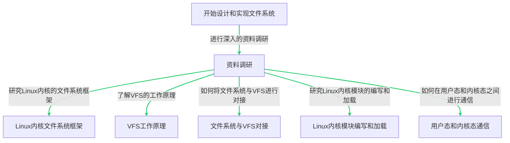

## 三、系统框架

revoFS项目的系统框架主要由两部分组成：**内核态的文件系统模块**和**用户态的应用程序**。

### 1. 内核态的文件系统模块

文件系统模块是运行在Linux内核态的部分，它负责处理文件和目录的读写操作。这个模块是作为Linux内核模块实现的，可以动态地加载和卸载。文件系统模块实现了新的文件系统的superblock、dentry、inode的读写操作，并将新创建的文件系统的操作接口与VFS（Virtual File System，虚拟文件系统）进行对接。VFS是Linux内核中的一个重要组件，它提供了一个抽象层，使得用户程序可以透明地访问各种不同类型的文件系统。

### 2. 用户态的应用程序

用户态的应用程序负责将一个块设备（可以用文件模拟）格式化成文件系统的格式。在我们的revoFS系统中，这个应用程序由一个脚本代替。脚本运行在用户态，主要功能是将块设备格式化成文件系统格式，并将其挂载到Linux系统上，便于演示文件系统。

以下是这个过程的流程图：
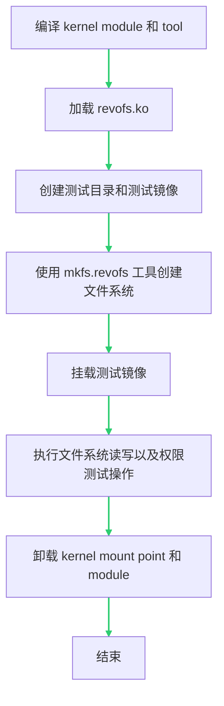

这个流程图描述了设计和实现文件系统的过程，包括文件系统的加载和卸载过程。
通过内核态的文件系统模块和用户态的应用程序的紧密协作，成功地实现了一个可以进行文件和目录的读写操作的Linux文件系统。

## 四、设计开发计划

在开始设计和实现revoFS项目之前，我们制定了详细的设计开发计划。以下是我们的主要开发步骤：

### 1. 设计文件系统的数据结构和接口

首先设计了文件系统的基本数据结构，包括superblock、dentry、inode等。这些数据结构是文件系统的基础，它们定义了文件系统中的文件和目录的属性和行为。此外，还设计了文件系统的接口，包括文件和目录的创建、删除、读写等操作。

在我们的文件系统代码中，定义了一个名为`revofs`的文件系统类型，它包含了自定义的挂载和卸载函数，以及其他一些文件系统特有的属性。当文件系统被加载时，`revofs_init`函数会被调用，它首先初始化inode缓存，然后注册文件系统。当文件系统被卸载时，`revofs_exit`函数会被调用，它会取消注册我们的文件系统，并销毁inode缓存。

以下是这个过程的流程图：

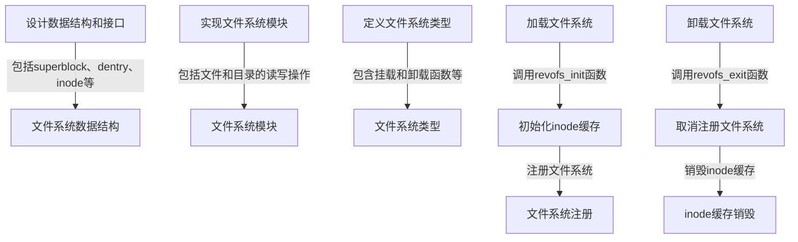

这个流程图描述了设计和实现文件系统的过程，包括设计文件系统的数据结构和接口，定义文件系统类型，以及加载和卸载文件系统的过程。

### 2. 实现文件系统模块

在设计了数据结构和接口之后，开始实现文件系统模块。文件系统模块是运行在Linux内核态的部分，它负责处理文件和目录的读写操作。我们实现了superblock、dentry、inode的读写操作，并将新创建的文件系统的操作接口与VFS进行对接。


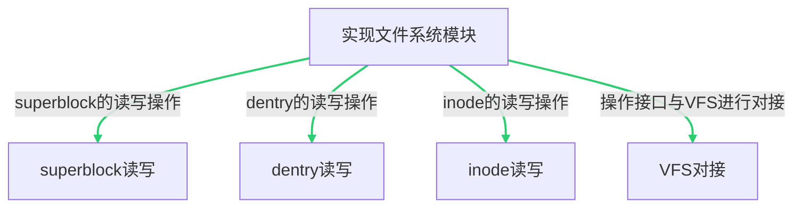

接下来，我们来看一下代码文件`fs.c`的内容。这个文件包含了文件系统模块的实现。主要的函数包括：

- `revofs_mount`：挂载revofs分区
- `revofs_kill_sb`：卸载revofs分区
- `revofs_init`：初始化revofs，包括创建inode缓存和注册文件系统
- `revofs_exit`：退出revofs，包括卸载文件系统和销毁inode缓存

这些函数实现了文件系统模块的基本功能，包括挂载和卸载文件系统，以及初始化和退出文件系统。

### 3. 设计并实现用户态应用程序

实现了一个用户态应用程序，该程序能够将一个块设备（可以用文件模拟）格式化成我们设计的文件系统的格式。这个应用程序运行在用户态，可以直接由用户操作。

应用程序的主要功能是将块设备格式化成文件系统格式，这样用户就可以在该应用程序中创建文件和目录，进行读写操作。


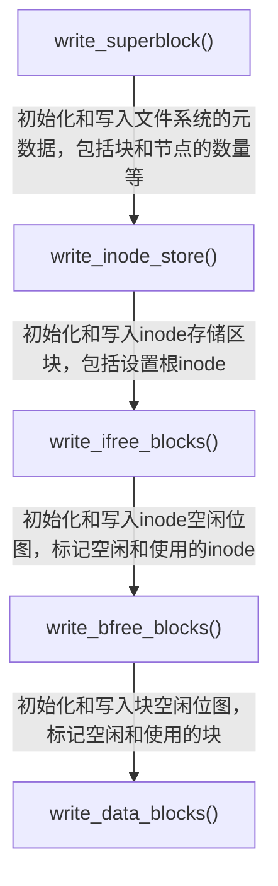

以下是代码文件`mkfs.c`的核心内容。这个文件包含了文件系统格式化的实现。主要的函数包括：

- `write_superblock()`：初始化superblock结构
- `write_inode_store()`：初始化inode存储区块
- `write_ifree_blocks()`：初始化和写入inode空闲位图
- `write_bfree_blocks()`：初始化和写入block空闲位图
### 4. 编写测试用例

在实现了文件系统模块和用户态应用程序之后，我们以一段精心设计的测试脚本，来展示我们文件系统的功能以及整个生命周期，以及用于验证文件系统的功能。测试脚本包括文件和目录的创建、删除、读写，以及文件权限的设置和检查。

通过这个设计开发计划，成功地实现了一个可以进行文件和目录的读写操作的Linux文件系统。文件系统在所有测试用例下都表现良好，证明了设计和实现是正确的。

## 五、比赛过程中的重要进展 

四月下旬，将新创建的文件系统的操作接口与VFS进行了对接，这是一个重要的里程碑，因为它使文件系统能够与Linux内核进行交互。
 进一步实现了新的文件系统的超级块、dentry、inode的读写操作，这些是文件系统的基础，它们定义了文件系统中的文件和目录的属性和行为。

五月初，实现了新的文件系统的权限属性，这意味着不同的用户可以有不同的操作属性，这增加了文件系统的安全性和灵活性。
成功地实现了与用户态程序的对接，这使得用户程序可以直接与我们的文件系统进行交互。

五月中旬，设计并实现了一个用户态应用程序，该程序可以将一个块设备（可以用文件模拟）格式化成我们设计的文件系统的格式。这是一个重要的步骤，使文件系统能够在实际的硬件设备上运行。

最后，设计了一个用户态的测试用例应用程序，用于测试和验证文件系统的open/read/write/ls/cd等常见文件系统访问操作。这个应用程序对文件系统进行了全面的测试，确保了其稳定性和可靠性。

## 六、系统测试情况

以下是文件系统测试目标描述 **（	全部已完成	）**

**1、设计实现一个Linux内核模块，此模块完成如下功能**	**（全部已完成）**

- 将新创建的文件系统的**操作接口和VFS对接**。 
- 实现新的文件系统的**超级块、dentry、inode的读写操作**。
- 实现新的**文件系统的权限属性**，不同的用户不同的操作属性。
- 实现和**用户态程序的对接**，用户程序

**2、设计实现一个用户态应用程序，可以将一个块设备（可以用文件模拟）格式化成自己设计的文件系统的格式。**	**（已完成）**

**3、设计一个用户态的测试用例应用程序，测试验证自己的文件系统的open/read/write/ls/cd 等通常文件系统的访问。**  **（已完成）**


我们的文件系统在各种测试用例下都表现良好，验证了文件和目录的读写操作，以及权限属性的正确性。为了方便验证，编写了`setup.sh`脚本，方便用户一键挂载文件系统：

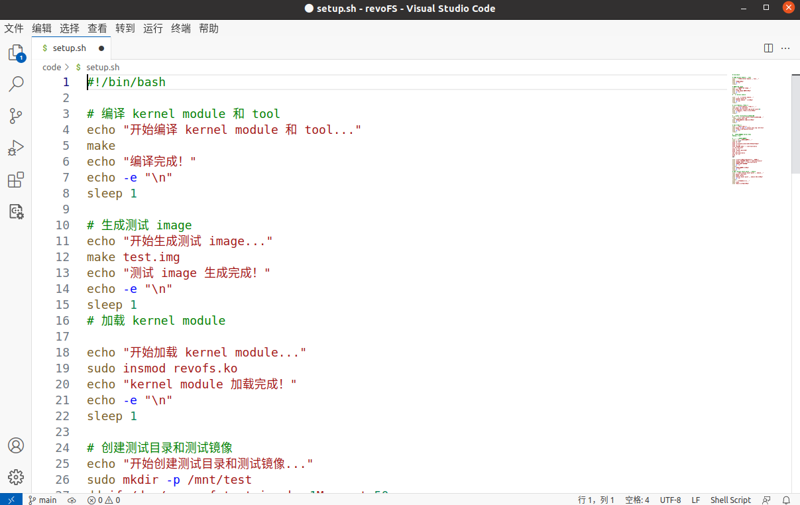


1.在代码文件夹下运行`setup.sh`，会先对模块使用`make`命令进行编译。**（已完成）**

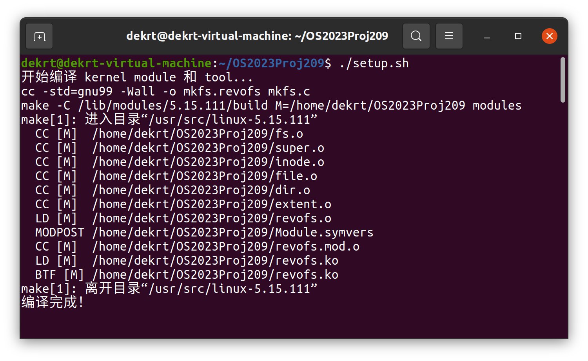


2.使用`make test.img`命令生成测试映像。**（已完成）**

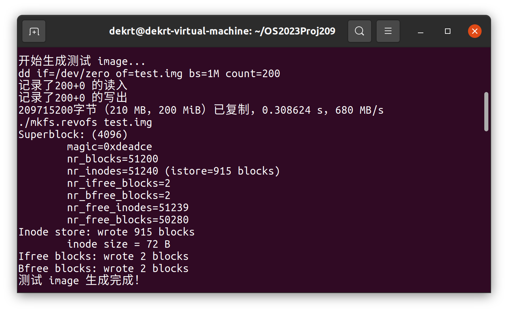


3.在`/mnt`创建一个50M的`test`分区   **（已完成）**

```shell
sudo mkdir -p /mnt/test
dd if=/dev/zero of=test.img bs=1M count=50
```

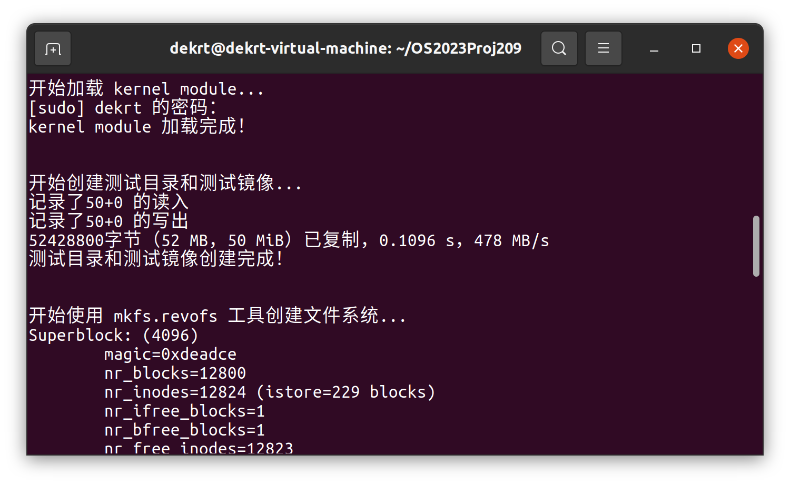


4.使用`mkfs.revofs`工具将块设备格式化为文件系统,,挂载测试镜像，并将其挂载到/mnt/test： **（已完成）** 

```shell
./mkfs.revofs test.img
sudo mount -o loop -t revofs test.img /mnt/test
```

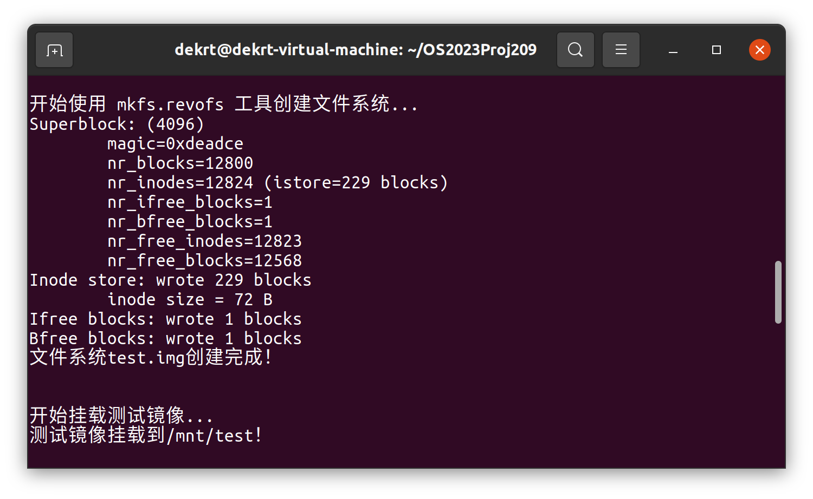


5.文件系统已经创建完成，验证读写操作(as root)：**（已完成）**

 ```shell
 sudo su
 echo "OSCOMP 2023 " > /mnt/test/hello
 ls -lR /mnt/test
 cat /mnt/test/hello
 exit
 ```

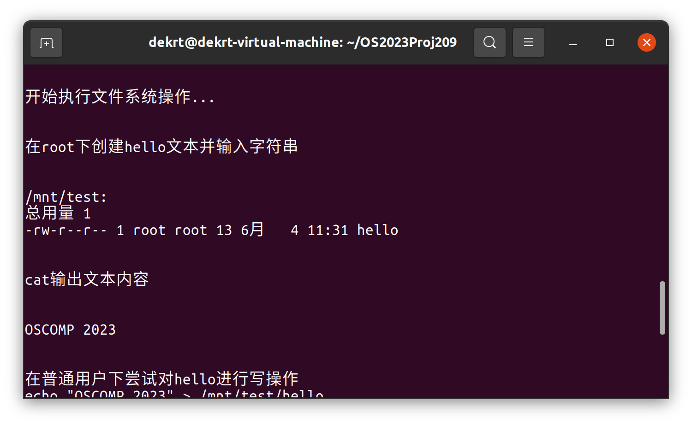


6.验证文件系统的权限属性： **（已完成）**

```shell
echo "echo \"OSCOMP 2023\" > /mnt/test/hello" 
echo "OSCOMP 2023 " > /mnt/test/hello
```

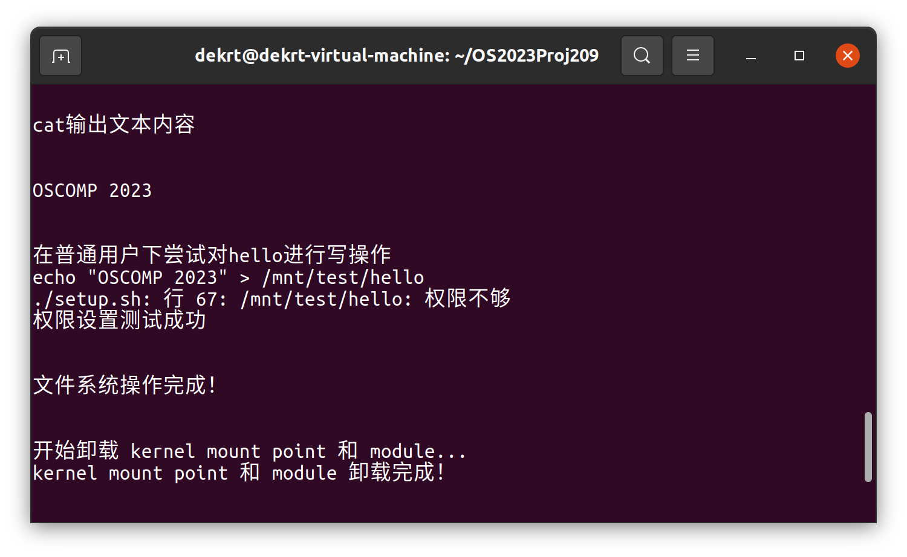


7.测试完成后，对模块进行卸载以及`make clean` **（已完成）**

```shell
sudo umount /mnt/test
sudo rmmod revofs
make clean
```

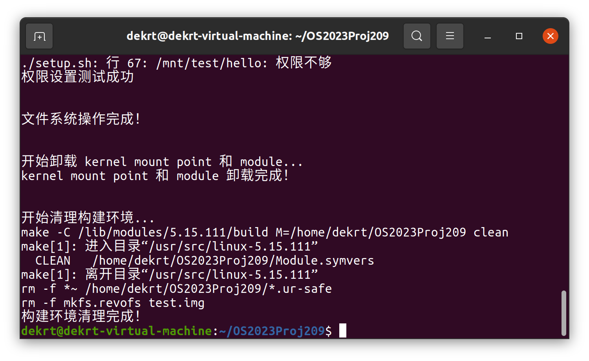

## 七、遇到的主要问题和解决方法

在revoFS项目的开发过程中，我们遇到了一些挑战性的问题，但通过团队合作和深入研究，成功地解决了这些问题。

### 1. 用户态和内核态之间的通信

在设计和实现文件系统时，需要在用户态应用程序和内核态文件系统模块之间进行通信。这是一个复杂的问题，因为用户态和内核态有不同的地址空间，不能直接进行数据交换。通过研究Linux内核的系统调用机制，了解了如何在用户态和内核态之间传递信息。我们设计了一套接口，通过这套接口，用户态应用程序可以发送请求到内核态文件系统模块，内核态文件系统模块可以返回结果到用户态应用程序。

### 2. 文件系统的权限属性

在实现文件系统的过程中，需要处理文件和目录的权限属性。这是一个挑战，因为权限属性涉及到许多复杂的问题，例如用户和组的管理，以及读、写、执行的权限控制。通过研究Linux内核的权限管理机制，了解了如何处理文件系统的权限属性。我们实现了一个权限管理模块，这个模块可以正确地处理文件和目录的权限属性。

### 3. 文件系统的数据结构和接口设计

设计文件系统的数据结构和接口是一个复杂的任务，因为它需要考虑到许多因素，例如文件和目录的组织方式，以及文件和目录的读写操作。通过阅读大量的技术文档和论文，以及参考其他开源的Linux文件系统项目，了解了如何设计文件系统的数据结构和接口。我们设计了一套高效且易用的数据结构和接口，使得文件系统可以正确且高效地进行文件和目录的读写操作。

通过解决这些问题，不仅提高了我们的技术能力，也增强了团队协作能力。期待在未来的项目中继续面对并解决更多的挑战。

## 八、分工和协作

我们的团队成员分工明确，协作紧，共同参与了文件系统的设计和实现，每个人都在自己的领域内发挥了重要作用。

| 功能点             | 负责人          | 备注 |
| ------------------ | --------------- | ---- |
| 项目前期选题、规划 | 陈德霆 / 张骁凯 | 无   |
| 项目编码工作       | 陈德霆 / 张骁凯 | 无   |
| 项目文档的撰写     | 陈德霆 / 张骁凯 | 无   |
| 技术指导           | 苏曙光老师      | 无   |

## 九、提交仓库目录和文件描述

代码和文档都存储Gitlab仓库中。以下是仓库目录和文件描述：

```
.revoFS/
│  .gitignore
│  README.md
│
├─code
│  │  .clang-format
│  │  bitmap.h
│  │  dir.c
│  │  extent.c
│  │  file.c
│  │  fs.c
│  │  inode.c
│  │  Makefile
│  │  mkfs.c
│  │  revofs.h
│  │  setup.sh
│  │  super.c
│  │  test.sh
│  │
│  └─test
└─pics
        revoFS.jpg
        setup.png
        SS_complie.png
        SS_create.png
        SS_image.png
        SS_mount.png
        SS_test.png
        SS_test_noroot.png
        SS_umount.png
```

## 十、比赛收获

参加这次比赛，收获颇丰。以下是我们的主要收获：

### 1. 深入理解Linux文件系统

通过设计和实现revoFS项目，我们深入了解了Linux文件系统的工作原理，学习了如何设计文件系统的数据结构和接口，如何实现文件系统模块，以及如何在用户态和内核态之间进行通信。这些知识不仅对我们的项目有所帮助，也对未来学习和工作有所帮助。

### 2. 提高编程和问题解决能力

在项目的开发过程中，我们遇到了许多挑战性的问题。通过查阅相关资料，进行实验，以及团队讨论，成功地解决了这些问题。这个过程提高了编程能力和问题解决能力。

### 3. 提升团队协作能力

在这个项目中，需要与团队成员紧密合作，共同完成任务。我们学习了如何有效地分配任务，如何进行有效的沟通，以及如何协调团队成员的工作。这个过程提升了团队协作能力。

### 4. 学习如何使用开源工具

在这个项目中，使用了许多开源工具，例如GitHub。我们学习了如何使用这些工具进行代码管理，如何进行版本控制，以及如何进行代码审查。这些技能对未来学习和工作都非常有用。

总的来说，通过参加这次比赛，不仅提高了技术能力，也增强了团队协作能力。期待在未来的比赛中继续学习和进步。